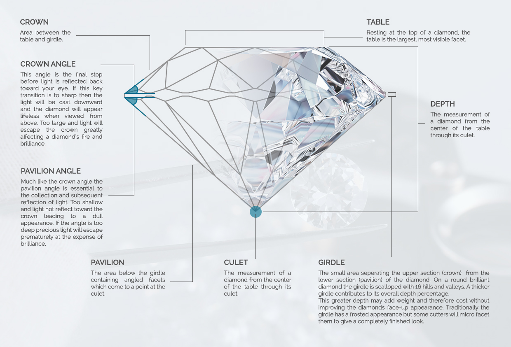
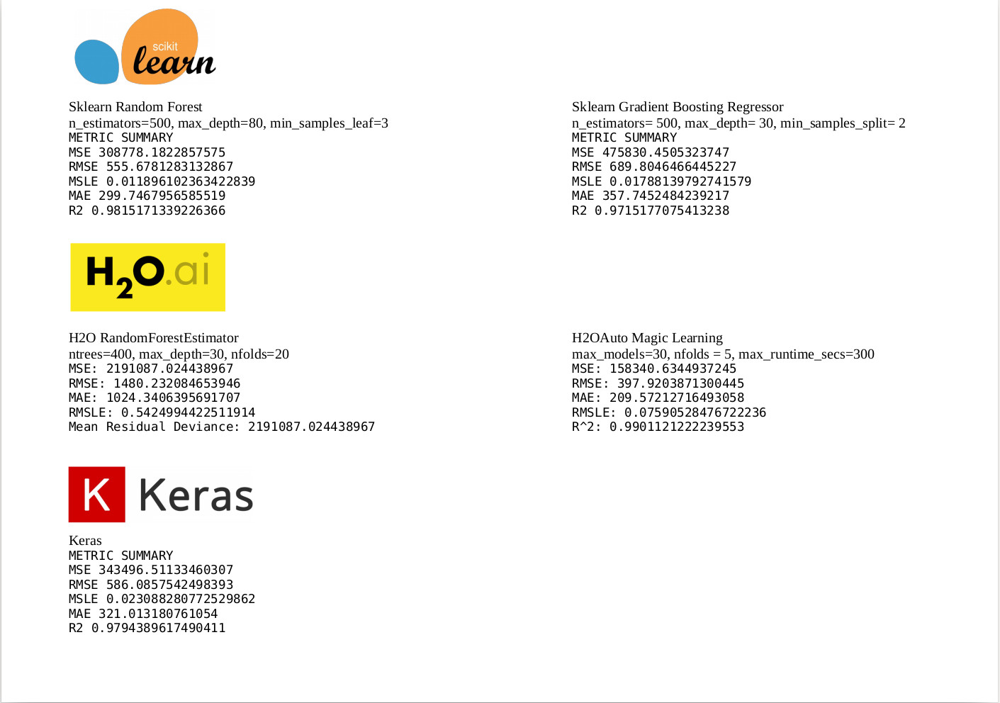

# Diamantes

Partiendo de un Dataset que contiene los precios y otros atributos de unos 54.000 diamantes trataremos mediante el analisis y aplicacion de técnicas de ML predecir el precio de los diamantes.

Los datos:

* Price:  Precio en Dolares (USA) (\$326--\$18,823)

* Carat:  Peso en quilates del diamante (0.2--5.01)

* Cut: Calidad de corte del corte (regular, buena, muy buena, premium, ideal)

* Color: Color diamante color, de J (peor) a D (mejor)

* Clarity:  Claridad del diamante (I1 (peor), SI2, SI1, VS2, VS1, VVS2, VVS1, IF (mejor))

* X:  Longitud en mm (0-10,74)

* Y:  Ancho en mm (0--58.9)

* Z: Profundidad en mm (0--31.8)

* Depth:  Porcentaje profundidad total = z / media(x, y) = 2 * z / (x + y) (43--79) 

* Table:  Ancho de la parte superior del diamante en relación con el punto más ancho (43-95)

## Evaluacion

La evaluacion se realizara mediante la metrica RMSE (Root Mean Squared Error):

https://en.wikipedia.org/wiki/Root-mean-square_deviation

## Resultados

Resultados con los diferentes modelos utilizados:

## Recursos

* [Sklearn](https://scikit-learn.org/stable/)
* [H2O ai](https://www.h2o.ai/)
* [Keras](https://keras.io/)
* [Kaggle](https://www.kaggle.com/shivam2503/diamonds)
